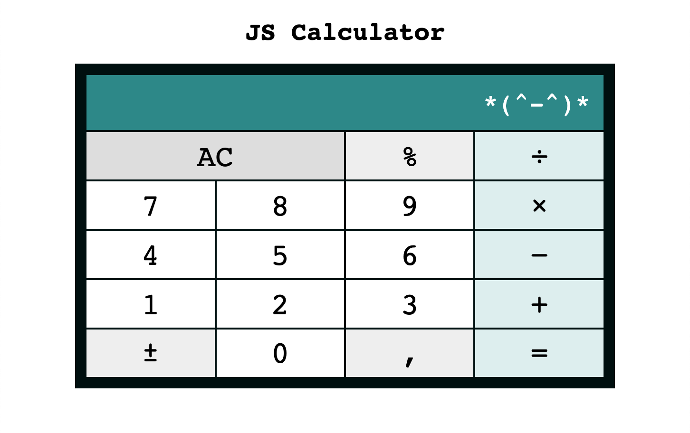

# JS Calculator

## Description

This is a simple calculator app created with HTML, CSS, and vanilla JS as a FrauenLoop student practice project.

[JS Calculator](https://olhanotolga.github.io/js-calculator/)



## Features

* [x] Performs _addition_, _subtraction_, _multiplication_, and _division_
* [x] Support of multi-digit numbers
* [x] Additional buttons and functionality:

  * ``` , ``` — adds a floating point
  * ``` +/- ``` — changes the sign
  * ``` % ``` — converts to percentage

* [x] Support of chained calculations (no need to press/click/tap ``` = ``` every time)
* [x] Automatic reset when starting a new calculation (no need to press/click/tap ``` AC ``` each time)
* [x] More or less well-behaving floats
* [x] Breaks down *__spectacularly__* upon dividing by zero 💥:bomb:💥
* [x] Responsive layout

## Code

HTML, CSS (with Flexbox, Grid, and media queries), JavaScript (ES6)
